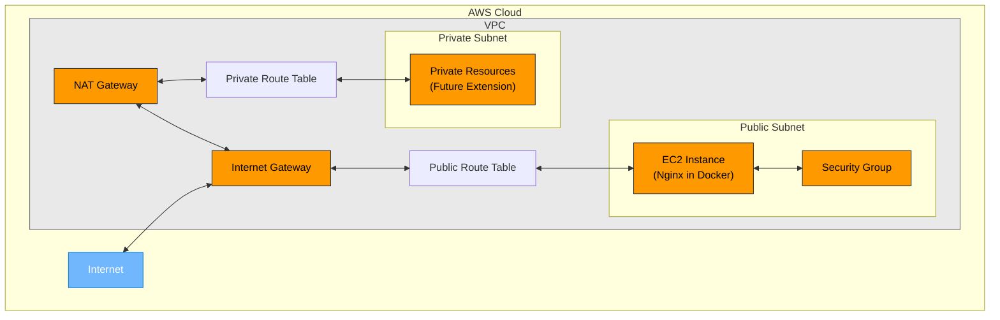

# TerraformNinja: AWS Cloud Infrastructure Automation

<div align="center">


**A production-ready Terraform infrastructure as code (IaC) solution for AWS deployments**

[](https://github.com/TheToriqul/aws-infra-automation/blob/main/LICENSE)
[](https://github.com/TheToriqul/aws-infra-automation/pulls)

</div>

## 📋 Overview

This repository contains infrastructure as code (IaC) using Terraform to automate the deployment of a robust AWS environment. The architecture includes a VPC with public/private subnets, NAT Gateway, and an EC2 instance running Nginx in Docker.

**Key Features:**
- 🌐 Fully automated VPC setup with public and private subnets
- 🚀 EC2 instance with Nginx deployed in Docker
- 🔒 Proper security groups configuration
- 🧩 Modular design for flexibility and reusability
- 🔄 Easily portable across AWS regions and environments

## 🏗️ Architecture

### Architecture Overview

This infrastructure implements a secure, scalable AWS architecture following best practices:

- **Networking Layer**: A custom VPC with separate public and private subnets spanning a single Availability Zone, with dedicated route tables for traffic management.
- **Access Controls**: Internet Gateway for public internet access and NAT Gateway to enable private subnet resources to access the internet securely.
- **Compute Layer**: EC2 instance running in the public subnet with Nginx deployed in Docker for web services.
- **Security**: Properly configured security groups to minimize the attack surface while allowing necessary traffic.

The design follows AWS Well-Architected Framework principles, particularly:
- **Security**: Isolation of resources between subnets
- **Reliability**: Proper networking configuration
- **Operational Excellence**: Infrastructure as code for consistent deployments
- **Cost Optimization**: Resources sized appropriately for workloads

### Architecture Diagram



## 📦 Prerequisites

- [Terraform](https://www.terraform.io/downloads.html) (>= 1.0.0)
- [AWS CLI](https://aws.amazon.com/cli/) installed and configured
- AWS account with appropriate permissions

## 🚀 Quick Start

1. **Clone the repository**

   ```bash
   git clone https://github.com/TheToriqul/aws-infra-automation.git
   cd aws-infra-automation
   ```

2. **Configure AWS credentials** (if not already configured)

   ```bash
   aws configure
   ```

3. **Initialize Terraform**

   ```bash
   terraform init
   ```

4. **Review the execution plan**

   ```bash
   terraform plan
   ```

5. **Apply the infrastructure**

   ```bash
   terraform apply
   ```

6. **Access your resources**

   After successful deployment, you can access the Nginx server using:
   ```bash
   echo "Nginx URL: http://$(terraform output -raw nginx_public_ip)"
   ```

## ⚙️ Configuration Options

The project can be customized through variables in `variables.tf` or by providing a `.tfvars` file.

### Example Configuration

Create a file named `terraform.tfvars`:

```hcl
aws_region         = "us-west-2"
vpc_cidr           = "10.0.0.0/16"
public_subnet_cidr = "10.0.1.0/24"
private_subnet_cidr = "10.0.2.0/24"
instance_type      = "t3.micro"
environment        = "staging"
ssh_key_name       = "my-key-pair"
```

### Key Variables

| Variable | Description | Default |
|----------|-------------|---------|
| `aws_region` | AWS region to deploy resources | `ap-southeast-1` |
| `environment` | Environment name (dev, staging, prod) | `dev` |
| `vpc_cidr` | CIDR block for the VPC | `10.0.0.0/16` |
| `instance_type` | EC2 instance type | `t2.medium` |
| `ssh_key_name` | SSH key pair name | `""` |

## 📁 Project Structure

```
aws-infra-automation/
├── .gitignore                   # Git ignore file
├── main.tf                      # Main Terraform configuration
├── outputs.tf                   # Root module outputs
├── variables.tf                 # Root module variables
└── modules/                     # Terraform modules
    ├── vpc/                     # VPC module
    │   ├── main.tf
    │   ├── outputs.tf
    │   └── variables.tf
    └── ec2/                     # EC2 module
        ├── main.tf
        ├── outputs.tf
        └── variables.tf
```

## 🔑 AWS Authentication Methods

This project supports multiple methods for AWS authentication:

### Method 1: AWS CLI Configuration (Recommended)

If you have AWS CLI installed, you can configure it with:

```bash
aws configure
```

Terraform will automatically use these credentials.

### Method 2: Environment Variables

```bash
export AWS_ACCESS_KEY_ID="your_access_key"
export AWS_SECRET_ACCESS_KEY="your_secret_key"
export AWS_REGION="ap-southeast-1"
```

### Method 3: AWS Profiles

```bash
export AWS_PROFILE=your-profile-name
terraform apply
```

## 🧹 Cleanup

To destroy all resources created by Terraform:

```bash
terraform destroy
```

## 🛡️ Security Best Practices

This infrastructure implements several security best practices:

- Separation of public and private subnets
- NAT Gateway for outbound internet access from private subnets
- Security group with limited inbound access
- Root volume encryption for EC2 instances

## 🔄 CI/CD Integration

This repository is designed to be easily integrated with CI/CD pipelines such as GitHub Actions, GitLab CI/CD, Jenkins, or AWS CodePipeline. CI/CD pipelines can automate the validation, planning, and deployment of the infrastructure, ensuring consistent and reliable deployments while maintaining infrastructure as code best practices.

A CI/CD pipeline for this project typically includes the following stages:
- **Validation**: Syntax checking and terraform validation
- **Planning**: Running terraform plan to preview changes
- **Approval**: Manual approval for production environments
- **Deployment**: Applying the terraform configuration
- **Testing**: Verifying the deployed infrastructure

CI/CD workflows will be added to this repository in the future.

## 🌐 Extending the Infrastructure

This modular infrastructure can be extended with:

- Additional EC2 instances
- RDS databases
- Load balancers
- Auto Scaling Groups
- S3 buckets
- CloudFront distributions

## 🤝 Contributing

Contributions are welcome! Please feel free to submit a Pull Request.

1. Fork the repository
2. Create your feature branch (`git checkout -b feature/amazing-feature`)
3. Commit your changes (`git commit -m 'Add some amazing feature'`)
4. Push to the branch (`git push origin feature/amazing-feature`)
5. Open a Pull Request

## 📝 License

This project is licensed under the MIT License - see the LICENSE file for details.

## 📬 Contact
📧 Md. Toriqul Islam - [toriqul.int@gmail.com](mailto:toriqul.int@gmail.com)  
👔 LinkedIn: [https://www.linkedin.com/in/thetoriqul/](https://www.linkedin.com/in/thetoriqul/)  
🐙 GitHub: [https://github.com/TheToriqul](https://github.com/thetoriqul)  
🌐 Portfolio: [https://thetoriqul.com](https://thetoriqul.com)

---

<div align="center">
  <sub>Built with ❤️ by <a href="https://thetoriqul.com">Md. Toriqul Islam</a></sub>
</div>